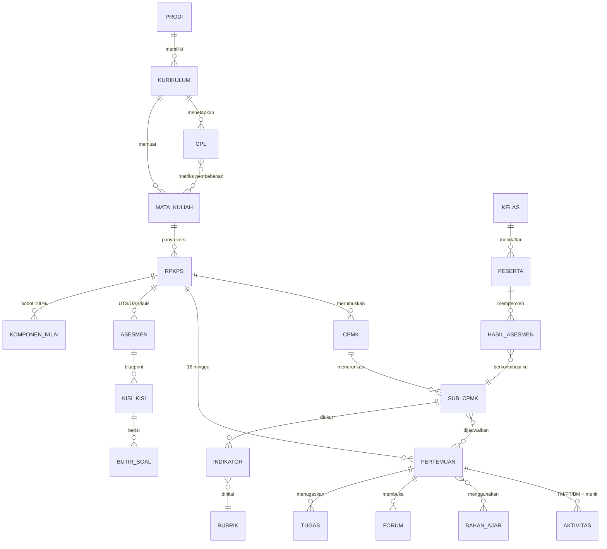

# Konsep Aplikasi Penyusunan RPKPS (Berbasis OBE)

Dokumen konsep — belum ada baris kode. Tujuannya: menyamakan pemahaman tentang *apa itu RPKPS*, *bagaimana dosen menyusunnya*, lalu menurunkannya menjadi rancangan aplikasi (modul, alur, model data, aturan hitung).

> Lapisan AI (integrasi LLM dengan token milik pengguna sendiri) dibahas terpisah di [01-konsep-ai-byok.md](./01-konsep-ai-byok.md).
>
> ⚠ **Sebagian dokumen ini sudah direvisi.** Setelah menelaah template RPKPS ITTS yang sebenarnya, format tabel mingguan (7 kolom, bukan 9) dan alur wizard (CPL/CPMK/Sub-CPMK datang terkunci dari buku kurikulum, bukan dirumuskan di aplikasi) berubah — lihat [02-template-itts-dan-penyelarasan-industri.md](./02-template-itts-dan-penyelarasan-industri.md). Selain itu **§3.1 dan §3.2 di bawah (kebijakan sks & rumus neraca waktu) sudah digantikan** oleh [03-kebijakan-beban-belajar.md](./03-kebijakan-beban-belajar.md). Bagian §3.3–§3.5 dan §4.7 masih berlaku.

---

## BAGIAN 1 — Memahami RPKPS

### 1.1 Definisi dan posisi regulasi

**RPKPS** (Rencana Program dan Kegiatan Pembelajaran Semester) adalah dokumen perencanaan satu mata kuliah untuk satu semester: apa yang akan dicapai mahasiswa, lewat kegiatan apa, dengan bahan apa, dinilai bagaimana, dan berapa bobotnya.

Istilah yang beredar ada dua dan sering dipertukarkan:

| | RPS | RPKPS |
|---|---|---|
| Asal istilah | SN-Dikti (istilah resmi regulasi) | UGM, lalu diadopsi banyak PT |
| Isi | Tabel rencana mingguan + identitas + CPL/CPMK | RPS + elaborasi: analisis pembelajaran, rencana evaluasi, rencana bahan ajar, kontrak kuliah |
| Praktik | Dokumen 3–6 halaman | Dokumen 8–15 halaman |

**Keputusan konsep:** aplikasi memperlakukan RPKPS sebagai *superset* dari RPS. Satu basis data, dua template keluaran (`RPS ringkas` dan `RPKPS lengkap`), sehingga PT yang hanya mewajibkan RPS tetap terlayani.

**Acuan regulasi:**
- **Permendikbud 3/2020** (SN-Dikti) — Pasal 12: komponen wajib RPS; Pasal 19: rincian menit per sks. Masih jadi rujukan teknis paling operasional di lapangan.
- **Permendikbudristek 53/2023** (Penjaminan Mutu Dikti) — mencabut pendekatan preskriptif, memberi PT keleluasaan; beban belajar dinyatakan **1 sks = 45 jam/semester** tanpa mengunci pembagian 50/60/60 per minggu.
- **Panduan Kurikulum Pendidikan Tinggi (Ditjen Diktiristek)** — sumber format tabel 9 kolom dan alur CPL → CPMK → Sub-CPMK yang dipakai hampir semua PT.

> Implikasi desain: aturan hitung waktu **tidak boleh di-hardcode**. Dibuat sebagai *policy* per institusi (lihat §3.1).

### 1.2 Komponen wajib (SN-Dikti Pasal 12)

1. Nama program studi, nama & kode mata kuliah, semester, sks, nama dosen pengampu
2. Capaian pembelajaran lulusan (CPL) yang dibebankan pada mata kuliah
3. Kemampuan akhir tiap tahapan belajar (Sub-CPMK) untuk memenuhi CPL
4. Bahan kajian yang terkait dengan kemampuan yang akan dicapai
5. Metode pembelajaran
6. Waktu yang disediakan untuk mencapai kemampuan pada tiap tahap
7. Pengalaman belajar mahasiswa dalam bentuk tugas
8. Kriteria, indikator, dan bobot penilaian
9. Daftar referensi yang digunakan

Sembilan butir ini adalah **checklist validasi minimum** aplikasi. Dokumen tidak boleh naik status ke "Diajukan" bila ada yang kosong.

### 1.3 Anatomi dokumen

```
A. HALAMAN IDENTITAS & PENGESAHAN
   Prodi, kode MK, nama MK, rumpun, sks (T/P), semester, tgl penyusunan,
   dosen pengembang, koordinator MK, Ka.Prodi, tanda tangan

B. CAPAIAN PEMBELAJARAN
   B1. CPL Prodi yang dibebankan pada MK        (CPL-1, CPL-3, CPL-7 …)
   B2. CPMK                                      (CPMK-1 … CPMK-n)
   B3. Sub-CPMK                                  (Sub-CPMK-1 … Sub-CPMK-16)
   B4. Matriks / peta CPL ↔ CPMK ↔ Sub-CPMK
   B5. Analisis pembelajaran (peta prasyarat antar Sub-CPMK)

C. DESKRIPSI SINGKAT MK, BAHAN KAJIAN, PUSTAKA (utama & pendukung),
   MEDIA PEMBELAJARAN, MK PRASYARAT

D. TABEL RENCANA PEMBELAJARAN MINGGUAN (inti — 9 kolom, §1.4)

E. RENCANA ASESMEN
   Komponen nilai & bobot, kisi-kisi UTS/UAS, rubrik, konversi nilai huruf

F. RENCANA TUGAS MAHASISWA (satu lembar per tugas)
   Tujuan, uraian, metode pengerjaan, luaran, kriteria penilaian, jadwal

G. LAMPIRAN: rubrik, jadwal, kontrak kuliah, rencana bahan ajar
```

### 1.4 Tabel mingguan — 9 kolom baku

| # | Kolom | Isi |
|---|---|---|
| 1 | Mg ke- | 1–16 |
| 2 | Sub-CPMK (kemampuan akhir tiap tahapan belajar) | 1 kalimat, kata kerja operasional |
| 3 | Indikator | Bukti terukur ketercapaian Sub-CPMK |
| 4 | Kriteria & bentuk penilaian | Rubrik/pedoman + bentuk (tes, non-tes) |
| 5 | Bentuk pembelajaran & metode (luring) | Kuliah, diskusi, PBL, PjBL, studi kasus… + **estimasi waktu** |
| 6 | Bentuk pembelajaran & metode (daring) | Sinkron/asinkron + **estimasi waktu** |
| 7 | Materi pembelajaran | Pokok bahasan + rujukan pustaka `[1] h.20–45` |
| 8 | Bobot penilaian (%) | Angka; total kolom = 100% |
| 9 | *(opsional)* Pengalaman belajar / penugasan | Aktivitas mahasiswa |

Kolom 5–6 inilah tempat "perhitungan waktu" bermuara, dan sekaligus titik lemah dokumen manual: hampir tidak ada yang menjumlahkannya dengan benar. Ini peluang utama aplikasi (§3.2).

---

## BAGIAN 2 — Prosedur Penyusunan (alur berpikir dosen)

Urutan ini menjadi **wizard** aplikasi. Setiap langkah punya masukan yang jelas dari langkah sebelumnya.

| Langkah | Aktivitas | Masukan | Keluaran |
|---|---|---|---|
| 1 | Tarik CPL prodi yang dibebankan pada MK | Matriks CPL × MK dari kurikulum prodi | Daftar CPL terpilih |
| 2 | Rumuskan **CPMK** | CPL + karakter MK | 3–6 CPMK (satu CPMK boleh menjabarkan >1 CPL) |
| 3 | Pecah jadi **Sub-CPMK** | CPMK | 12–16 Sub-CPMK, satu per pertemuan (atau satu untuk 2 pertemuan) |
| 4 | Susun **analisis pembelajaran** | Sub-CPMK | Peta prasyarat/urutan → menentukan urutan minggu |
| 5 | Tentukan **bahan kajian & materi** | Sub-CPMK | Pokok/sub-pokok bahasan + rujukan pustaka |
| 6 | Pilih **bentuk & metode pembelajaran** | Sub-CPMK (level Bloom) | Metode per pertemuan + porsi luring/daring |
| 7 | Hitung **alokasi waktu** | sks + metode | TM/PT/BM per pertemuan (§3.1–3.2) |
| 8 | Rancang **penugasan, forum, praktikum** | Sub-CPMK | Lembar rencana tugas + jadwal |
| 9 | Rancang **asesmen**: indikator → kriteria → bentuk → rubrik | Sub-CPMK | Rubrik + kisi-kisi UTS/UAS |
| 10 | Tetapkan **bobot penilaian** | CPMK & asesmen | Bobot per Sub-CPMK, total 100% |
| 11 | **Validasi & pengesahan** | Seluruhnya | RPKPS terbit, versi terkunci |

### Aturan perumusan CPMK/Sub-CPMK

Format kalimat: **Mahasiswa mampu [KKO] [objek] [kondisi/konteks] [tingkat keberhasilan]** — pola A-B-C-D (Audience, Behaviour, Condition, Degree).

Kata kerja operasional mengikuti Bloom revisi:
- Kognitif C1–C6: mengingat → memahami → menerapkan → menganalisis → mengevaluasi → mencipta
- Afektif A1–A5: menerima → menanggapi → menilai → mengelola → menghayati
- Psikomotor P1–P5: meniru → manipulasi → presisi → artikulasi → naturalisasi

Aplikasi menyediakan **kamus KKO** (dropdown + pencarian) dan memberi peringatan bila:
- Sub-CPMK memakai kata non-terukur ("memahami", "mengetahui") pada level yang seharusnya C3+
- Level Bloom Sub-CPMK melampaui level CPMK induknya
- Satu Sub-CPMK mengandung >1 kata kerja utama (harus dipecah)

---

## BAGIAN 3 — Aturan & Rumus yang Dapat Dikodekan

Inilah bagian yang membuat aplikasi lebih dari sekadar formulir.

### 3.1 Kebijakan beban belajar (dapat dikonfigurasi per institusi)

**Mode A — klasik (SN-Dikti 3/2020, default):** per 1 sks per minggu

| Bentuk pembelajaran | TM (tatap muka) | PT (terstruktur) | BM (mandiri) | Total |
|---|---|---|---|---|
| Kuliah, responsi, tutorial | 50′ | 60′ | 60′ | **170′** |
| Seminar / sejenis | 100′ | — | 70′ | **170′** |
| Praktikum, studio, bengkel, lapangan, penelitian, PkM, KKN | — | 170′ (kegiatan terjadwal) | — | **170′** |

**Mode B — fleksibel (Permendikbudristek 53/2023):** 1 sks = **45 jam/semester**, distribusi bebas asal total terpenuhi. Berguna untuk blok, MBKM, dan blended learning.

Konsistensi kedua mode: 16 minggu × 170′ = 2.720′ ≈ **45,3 jam** — jadi Mode A adalah salah satu cara memenuhi Mode B.

**Struktur semester:** 16 minggu, umumnya 14 pertemuan efektif + minggu UTS + minggu UAS. Konfigurabel (ada PT yang memakai 16 pertemuan efektif dengan UTS/UAS di dalamnya).

### 3.2 Neraca Waktu Mingguan — fitur pembeda

Setiap pertemuan punya **pagu waktu** dari sks, dan setiap aktivitas yang didaftarkan dosen (kuliah, diskusi forum, kuis, membaca, mengerjakan tugas, praktikum) **memakan** pagu itu dengan kategori TM/PT/BM.

```
Pagu(minggu) = sks × menit_per_sks(bentuk_pembelajaran)
Terpakai(minggu) = Σ durasi_menit aktivitas, dikelompokkan per kategori
Selisih = Pagu − Terpakai      → hijau (±10%), kuning, merah
```

Contoh MK 3 sks (kuliah), Mode A → pagu 510′/minggu (TM 150′, PT 180′, BM 180′).

| Aktivitas minggu ke-5 | Kategori | Menit |
|---|---|---|
| Kuliah interaktif + studi kasus (luring) | TM | 100 |
| Video asinkron + kuis LMS | TM (daring) | 50 |
| Forum diskusi kasus (asinkron, wajib 2 posting) | PT | 60 |
| Mengerjakan Tugas-2 (analisis jurnal) | PT | 120 |
| Membaca Pustaka [1] Bab 4 | BM | 120 |
| Menyiapkan presentasi kelompok | BM | 60 |
| **Total** | | **510 ✓** |

Nilai tambah: total semester otomatis terhitung, dan beban mahasiswa terlihat merata atau menumpuk. Ini juga langsung mengisi kolom 5–6 tabel mingguan tanpa dosen mengetik ulang.

### 3.3 Aturan bobot & penilaian

```
Σ bobot semua komponen nilai = 100%                    (wajib)
Σ bobot kolom 8 tabel mingguan = 100%                  (wajib)
Setiap CPMK punya ≥ 1 asesmen                          (wajib)
Setiap Sub-CPMK punya ≥ 1 indikator + 1 bentuk nilai   (wajib)
Setiap CPL terbeban punya ≥ 1 CPMK                     (wajib)
Bobot per CPMK = Σ bobot Sub-CPMK di bawahnya          (turunan, read-only)
```

### 3.4 Rumus ketercapaian OBE (dipakai saat semester berjalan/berakhir)

```
Nilai Sub-CPMK   = Σ(skor_asesmen_i × bobot_i) / Σ bobot_i
Nilai CPMK       = Σ(Nilai Sub-CPMK_j × bobot_j) / Σ bobot_j
Capaian CPL(MK)  = Σ(Nilai CPMK_k × kontribusi_k) / Σ kontribusi_k
Nilai akhir MK   = Σ(skor komponen × bobot komponen)
Capaian CPL Prodi = Σ(Capaian CPL(MK) × sks_MK) / Σ sks_MK
```

Ambang ketercapaian (mis. ≥ 65 atau ≥ 70) dikonfigurasi prodi. Keluaran: kurva capaian per CPL, daftar Sub-CPMK dengan capaian rendah → bahan **evaluasi & tindak lanjut** untuk RPKPS semester berikutnya (loop perbaikan berkelanjutan OBE).

### 3.5 Kisi-kisi UTS/UAS (blueprint)

Matriks: **Sub-CPMK × jumlah butir × level Bloom × bentuk soal × skor**.

Validasi otomatis:
- Semua Sub-CPMK yang dijadwalkan sebelum UTS terwakili di kisi-kisi UTS
- Total skor butir = 100 (atau skala yang ditetapkan)
- Distribusi level Bloom tidak timpang (mis. tidak 100% C1–C2 untuk MK level lanjut)
- Bobot per Sub-CPMK di kisi-kisi ≈ proporsi bobot di tabel mingguan

---

## BAGIAN 4 — Konsep Aplikasi

### 4.1 Masalah yang diselesaikan

| Masalah nyata | Solusi aplikasi |
|---|---|
| RPS/RPKPS disalin-tempel antar MK, CPL tidak nyambung | CPL ditarik dari master kurikulum, matriks terkunci |
| Alokasi waktu asal tulis, tidak pernah dijumlah | Neraca waktu mingguan otomatis |
| Bobot penilaian tidak 100% / CPMK tidak pernah dinilai | Validator wajib sebelum pengesahan |
| Dokumen tersebar di Word, versi tidak jelas | Versioning + workflow pengesahan + arsip |
| Ketercapaian CPL dihitung manual jelang akreditasi | Dihitung dari nilai riil, laporan siap unduh |
| Bahan ajar tidak terhubung ke rencana | Repositori bahan ajar ter-map ke pertemuan |
| Forum/tugas di LMS lepas dari RPKPS | Forum & tugas didefinisikan di RPKPS, disinkron ke LMS |

### 4.2 Peran pengguna

| Peran | Kewenangan |
|---|---|
| **Admin institusi** | Master data, kebijakan sks, template dokumen, tahun akademik, integrasi |
| **Ka. Prodi** | Kelola kurikulum, CPL, profil lulusan, matriks CPL×MK, menyetujui RPKPS |
| **Koordinator MK** | Menyusun & mengajukan RPKPS, mengelola tim teaching |
| **Dosen pengampu** | Mengisi bagian yang didelegasikan, mengelola materi/forum/tugas/nilai kelas |
| **GPM / Penjaminan Mutu** | Review, beri catatan, audit checklist, lihat semua |
| **Mahasiswa** | Baca RPKPS terbit, ikut forum, kumpul tugas, lihat capaian pribadi |
| **Asesor/Auditor (tamu)** | Akses baca terbatas + unduh berkas untuk akreditasi |

### 4.3 Peta modul

```
┌─ FONDASI ──────────────────────────────────────────────────┐
│ M1 Master & Organisasi   prodi, tahun akademik, pengguna,  │
│                          kebijakan sks, kalender akademik  │
│ M2 Kurikulum & CPL       profil lulusan, CPL, bahan kajian,│
│                          struktur MK, matriks CPL×MK       │
└────────────────────────────────────────────────────────────┘
┌─ PERENCANAAN (inti) ───────────────────────────────────────┐
│ M3 Penyusun RPKPS        wizard 11 langkah, autosave       │
│ M4 Kalkulator Waktu      neraca TM/PT/BM, kalender, libur  │
│ M5 Bank Materi & Bahan Ajar  repositori, versi, lisensi    │
│ M6 Rancangan Asesmen     rubrik, kisi-kisi, bank soal      │
│ M7 Validasi & Pengesahan workflow, tanda tangan, versi     │
└────────────────────────────────────────────────────────────┘
┌─ PELAKSANAAN ──────────────────────────────────────────────┐
│ M8  Kelas & Jadwal       kelas paralel, peserta, BAP       │
│ M9  Forum Diskusi        topik per pertemuan, rubrik, nilai│
│ M10 Tugas                penugasan, submit, plagiarisme*   │
│ M11 UTS / UAS            kisi-kisi → soal → pelaksanaan    │
│ M12 Penilaian            entri nilai, konversi huruf       │
└────────────────────────────────────────────────────────────┘
┌─ EVALUASI ─────────────────────────────────────────────────┐
│ M13 Analitik OBE         capaian Sub-CPMK/CPMK/CPL         │
│ M14 Pelaporan & Ekspor   PDF/DOCX/XLSX, berkas akreditasi  │
│ M15 Integrasi            SIAKAD/Neo Feeder, LMS, SSO       │
└────────────────────────────────────────────────────────────┘
   * opsional / fase lanjut
```

### 4.4 Alur utama penyusunan (wizard)

```
[Pilih MK & Tahun Ajaran]
        ↓  tarik sks, semester, prasyarat, CPL terbeban dari kurikulum
[1] Identitas & tim pengampu
[2] Deskripsi MK + pustaka utama/pendukung
[3] CPL terbeban  →  [4] CPMK  →  [5] Sub-CPMK      ← kamus KKO + validator Bloom
[6] Analisis pembelajaran (drag & drop urutan/prasyarat)
[7] Susun 16 pertemuan
      └ per pertemuan: Sub-CPMK, materi, metode, aktivitas+durasi,
        bahan ajar, forum, tugas, indikator, kriteria, bobot
        └ panel kanan: NERACA WAKTU (live)
[8] Rancang tugas (lembar rencana tugas per tugas)
[9] Rancang asesmen: komponen nilai, rubrik, kisi-kisi UTS/UAS
[10] Pratinjau dokumen (RPS ringkas / RPKPS lengkap)
[11] Validasi otomatis → Ajukan
        ↓
   Review Kaprodi/GPM ──(revisi)──> kembali ke penyusun
        ↓ setuju
   TERBIT (versi 1.0, terkunci) → dapat diunduh & dilihat mahasiswa
```

### 4.5 Siklus hidup dokumen

```
DRAFT ──ajukan──> DIAJUKAN ──review──> ┬─ DIREVISI ──> DRAFT (v1.1)
                                       └─ DISETUJUI ──> TERBIT ──> ARSIP
                                                          │
                                              (semester berjalan)
                                                          ↓
                                              EVALUASI & TINDAK LANJUT
                                                          ↓
                                        salin sebagai basis semester berikutnya
```

Aturan versi: dokumen TERBIT bersifat *immutable* (snapshot JSON + PDF ber-hash). Perubahan menghasilkan versi baru dengan riwayat perbedaan (diff) yang bisa dilihat.

### 4.6 Rincian modul kunci

**M5 — Materi & Bahan Ajar**
- Hierarki: `Bahan Kajian → Pokok Bahasan → Sub-Pokok Bahasan` (terhubung ke Sub-CPMK)
- Jenis bahan ajar: modul/diktat, slide, video, audio, jobsheet praktikum, studi kasus, dataset, tautan eksternal, e-book, OER
- Atribut: judul, jenis, berkas/URL, ukuran, versi, penulis, lisensi (mis. CC-BY), status (draf/terbit), estimasi durasi belajar (masuk neraca waktu), tanggal rilis ke mahasiswa
- Satu bahan ajar dapat dipakai di banyak pertemuan/MK (relasi many-to-many) — mendorong penggunaan ulang
- Pelacakan kelengkapan: "Pertemuan 9 belum punya bahan ajar"

**M9 — Forum**
- Forum melekat pada pertemuan; punya Sub-CPMK, pemicu diskusi, aturan minimal partisipasi (mis. 1 posting + 2 tanggapan), jendela waktu buka/tutup, estimasi menit (masuk kategori PT), rubrik penilaian, bobot
- Penilaian forum dapat otomatis-bantu: jumlah posting, ketepatan waktu, panjang; skor kualitas tetap manual berbasis rubrik

**M10 — Tugas**
- Lembar Rencana Tugas mengikuti format baku: tujuan tugas, uraian tugas (objek garapan, batasan, metode pengerjaan, bentuk luaran), indikator & kriteria penilaian, jadwal, daftar rujukan
- Jenis: individu/kelompok; bentuk: makalah, laporan praktikum, proyek, presentasi, kuis, portofolio
- Atribut operasional: dibuka, tenggat, toleransi terlambat + penalti, format berkas, ukuran maks, rubrik, bobot, estimasi menit pengerjaan

**M11 — UTS & UAS**
- Alur: Kisi-kisi (blueprint) → Bank Soal (butir bertag Sub-CPMK + level Bloom + tingkat kesukaran) → Paket Soal (acak/manual, paket A/B) → Pelaksanaan → Penilaian per butir → analisis butir (daya beda, tingkat kesukaran)
- Bentuk: tertulis, lisan, take-home, praktik, proyek, open book
- Skor per butir mengalir ke Sub-CPMK → tidak perlu hitung ulang untuk laporan OBE

**M13 — Analitik OBE**
- Dasbor per MK: capaian tiap Sub-CPMK/CPMK, distribusi nilai, butir soal bermasalah
- Dasbor prodi: capaian CPL lintas MK & angkatan, tren antar semester
- Ekspor tabel siap tempel untuk LKPS/LED akreditasi

### 4.7 Model data (garis besar)



Kelompok entitas (± 30 tabel):

| Kelompok | Entitas |
|---|---|
| Organisasi | `institusi`, `fakultas`, `prodi`, `tahun_akademik`, `pengguna`, `peran`, `kebijakan_sks`, `kalender_akademik` |
| Kurikulum | `kurikulum`, `profil_lulusan`, `cpl`, `bahan_kajian`, `mata_kuliah`, `mk_prasyarat`, `matriks_cpl_mk` |
| RPKPS | `rpkps`, `rpkps_versi`, `rpkps_pengampu`, `cpmk`, `sub_cpmk`, `peta_cpmk_cpl`, `pertemuan`, `aktivitas_belajar`, `materi`, `pustaka` |
| Bahan ajar | `bahan_ajar`, `bahan_ajar_versi`, `pertemuan_bahan_ajar` |
| Asesmen | `komponen_nilai`, `indikator`, `rubrik`, `kriteria_rubrik`, `level_rubrik`, `asesmen`, `kisi_kisi`, `butir_soal`, `paket_soal` |
| Pelaksanaan | `kelas`, `peserta_kelas`, `bap` (berita acara), `forum`, `forum_post`, `tugas`, `pengumpulan_tugas`, `hasil_asesmen`, `nilai_akhir` |
| Tata kelola | `alur_persetujuan`, `catatan_review`, `log_audit`, `lampiran`, `capaian_cpl` |

**Catatan desain penting:** `hasil_asesmen` menyimpan skor pada level **butir/kriteria**, bukan hanya nilai agregat. Tanpa ini, capaian Sub-CPMK tidak bisa dihitung dan seluruh janji OBE gugur.

### 4.8 Keluaran dokumen

| Dokumen | Format | Pemakai |
|---|---|---|
| RPS ringkas (9 kolom) | PDF, DOCX | Dosen, prodi |
| RPKPS lengkap | PDF, DOCX | Prodi, akreditasi |
| Kontrak kuliah | PDF | Mahasiswa |
| Lembar Rencana Tugas | PDF | Mahasiswa |
| Rubrik penilaian | PDF, XLSX | Dosen, mahasiswa |
| Kisi-kisi UTS/UAS | PDF, XLSX | Dosen, GPM |
| Berita acara perkuliahan | PDF | Prodi |
| Laporan capaian CPL | PDF, XLSX | Prodi, LPM, asesor |
| Matriks CPL×MK | XLSX | Kurikulum |

Template dokumen harus dapat diganti per institusi (kop, urutan bagian, redaksi tanda tangan) tanpa mengubah kode.

### 4.9 Integrasi

- **SSO**: Google Workspace / Microsoft Entra / SIAKAD lokal
- **SIAKAD & Neo Feeder**: tarik master MK, kelas, peserta; dorong nilai akhir
- **LMS (Moodle / Google Classroom)**: dorong pertemuan, materi, forum, tugas; tarik status pengumpulan
- **Penyimpanan berkas**: S3-compatible (bahan ajar bisa besar — video)
- Semua integrasi dirancang **opsional** dan berbasis adapter; aplikasi harus tetap utuh tanpa satupun terhubung

---

## BAGIAN 5 — Arah Teknis (ringkas)

Belum implementasi, tapi konsep menuntut beberapa hal:

- **Next.js (App Router)** + TypeScript; server actions untuk form berat, RSC untuk halaman baca
- **PostgreSQL + Prisma**. Alasan: relasi banyak-ke-banyak yang padat (CPL↔CPMK↔Sub-CPMK↔asesmen) dan kebutuhan agregasi numerik
- **Autorisasi berlapis**: peran × cakupan (institusi/prodi/MK/kelas). Diputuskan di awal, bukan ditambal belakangan
- **Versioning**: tabel `rpkps_versi` menyimpan snapshot JSON penuh + hash; dokumen terbit tidak pernah diubah di tempat
- **Ekspor dokumen**: DOCX via `docxtemplater` (agar template dikelola non-programmer), PDF via Playwright/`react-pdf`
- **Autosave + draf lokal**: wizard 11 langkah panjang; kehilangan isian adalah pembunuh adopsi
- **i18n**: Bahasa Indonesia sebagai bahasa utama; sediakan kolom bilingual pada CPL/CPMK karena akreditasi internasional sering meminta versi Inggris

---

## BAGIAN 6 — Roadmap

| Fase | Isi | Hasil yang bisa dipakai |
|---|---|---|
| **F0 — Fondasi** | Auth, peran, master prodi/tahun akademik, kebijakan sks | Bisa login, data dasar siap |
| **F1 — Kurikulum** | Profil lulusan, CPL, MK, matriks CPL×MK | Kurikulum prodi terekam rapi |
| **F2 — Penyusun RPKPS (MVP)** | Wizard, 16 pertemuan, neraca waktu, validator, ekspor PDF/DOCX | **Dosen sudah bisa berhenti pakai Word** |
| **F3 — Asesmen** | Rubrik, komponen nilai, kisi-kisi, lembar rencana tugas | Dokumen RPKPS lengkap sesuai standar |
| **F4 — Pengesahan** | Workflow review, versi, tanda tangan, arsip | Prodi bisa mengendalikan mutu dokumen |
| **F5 — Bahan ajar** | Repositori, versi, mapping ke pertemuan | Materi terhubung ke rencana |
| **F6 — Pelaksanaan** | Kelas, forum, tugas, UTS/UAS, entri nilai | Aplikasi menemani semester berjalan |
| **F7 — Analitik OBE** | Capaian Sub-CPMK/CPMK/CPL, laporan akreditasi | Nilai jual terbesar ke pimpinan |
| **F8 — Integrasi** | SIAKAD/Feeder, LMS, SSO | Berhenti input ganda |

**Batas MVP yang disarankan: F0–F4.** Sudah menyelesaikan masalah paling nyeri (menyusun & mengesahkan RPKPS) tanpa harus bersaing dengan LMS yang sudah ada.

---

## BAGIAN 7 — Risiko & Keputusan yang Perlu Ditetapkan

| Risiko | Mitigasi |
|---|---|
| Dosen enggan mengisi wizard panjang | Impor dari RPKPS lama, salin dari semester/MK lain, isian awal terbantu template prodi |
| Aplikasi bertabrakan dengan LMS institusi | Fokus pada perencanaan & OBE; modul pelaksanaan dibuat opsional/sinkron ke LMS |
| Format dokumen tiap PT berbeda | Template dokumen sebagai data, bukan kode |
| Regulasi berubah lagi | Kebijakan sks & struktur semester sebagai konfigurasi |
| Data nilai per butir tidak pernah diisi → analitik kosong | Buat entri nilai per komponen semudah mungkin; sediakan impor XLSX |

**Perlu diputuskan sebelum masuk desain teknis:**

1. **Cakupan pengguna** — satu prodi/institusi (single-tenant) atau multi-institusi (multi-tenant)?
2. **Batas MVP** — berhenti di dokumen RPKPS (F0–F4), atau langsung sampai pelaksanaan (forum/tugas/UTS/UAS, F0–F6)?
3. **Format acuan** — apakah mengikuti template RPKPS institusi tertentu, atau format generik Ditjen Diktiristek?
4. **Kebijakan sks** — pakai Mode A (50/60/60) sebagai default, Mode B (45 jam), atau keduanya tersedia?
5. **Posisi terhadap LMS** — menggantikan, mendampingi, atau menyinkronkan?
6. **Sumber data mahasiswa & kelas** — input manual, impor XLSX, atau integrasi SIAKAD sejak awal?

---

## Referensi

- [Permendikbudristek No. 53 Tahun 2023 — Penjaminan Mutu Pendidikan Tinggi](https://kemdiktisaintek.go.id/kabar-dikti/kabar/permendikbudristek-nomor-53-tahun-2023-perguruan-tinggi-fleksibel-kembangkan-standar-kompetensi-lulusan/)
- [Standar Proses Pembelajaran & Penilaian Baru di Permendikbudristek 53/2023](https://sevima.com/inilah-standar-proses-pembelajaran-dan-penilaian-baru-di-permendikbudristek-no-53-tahun-2023/)
- [Buku Panduan Penyusunan RPS (UNIMA)](https://unima.ac.id/uploads/img_direktori/1672193436734.pdf)
- [Pedoman Penyusunan RPS (FKIP Unsam)](https://pgsd.fkip.unsam.ac.id/wp-content/uploads/2025/01/Pedoman-Penyusunan-RPS-14-3-23.pdf)
- [Format RPKPS FEB UGM](https://maksi.feb.ugm.ac.id/wp-content/uploads/sites/84/2022/08/RPKPS-format-FEB_ALK-MAKSI1.pdf)
- [RPKPS Sarjana — Fakultas Pertanian UGM](https://web.faperta.ugm.ac.id/rencana-program-dan-kegiatan-pembelajaran-semester-rpkps/)
- [Rencana Pembelajaran Semester: Isi dan Pedoman Penyusunan](https://penerbitdeepublish.com/rps-adalah/)
